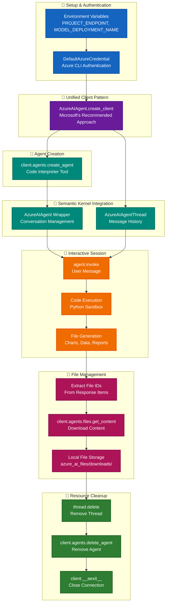

# Azure AI Foundry + Semantic Kernel Integration

A comprehensive, hands-on tutorial demonstrating Microsoft's recommended patterns for integrating Azure AI Foundry Agent Service with Semantic Kernel. Learn to build production-ready AI agents with code interpretation, file generation, and secure resource management.

## 🎯 What You'll Learn

This tutorial teaches **Microsoft's unified client pattern** for building enterprise-grade AI agents:

- **🔄 Unified Client Architecture**: Single `AzureAIAgent.create_client()` for all operations
- **🤖 Agent Creation & Management**: Azure AI Foundry agent service integration
- **💬 Conversation Handling**: Semantic Kernel wrapper for thread management
- **⚙️ Code Interpreter**: Sandboxed Python execution with file generation
- **📁 File Operations**: Secure download and local preservation patterns
- **🧹 Resource Lifecycle**: Proper cleanup and cost management

## 🏗️ Architecture & Learning Flow



### Core Learning Principles

1. **🔄 Microsoft's Unified Client Pattern**:
   - Use `AzureAIAgent.create_client()` for all Semantic Kernel operations
   - Single client instance handles agent creation, conversations, and file operations
   - Eliminates complex sync/async client management patterns

2. **🤖 Enterprise Agent Architecture**:
   - Create agents with `await client.agents.create_agent()` 
   - Wrap with `AzureAIAgent(client=client, definition=agent_definition)`
   - Manage conversations through `AzureAIAgentThread(client=client)`

3. **⚙️ Code Interpreter Integration**:
   - Sandboxed Python execution environment
   - Automatic file generation and storage
   - Secure code execution with built-in safety measures

4. **📁 Production File Management**:
   - Extract file IDs from `response.items` with proper error handling
   - Stream download with `await client.agents.files.get_content(file_id)`
   - Local preservation while maintaining Azure resource hygiene

5. **🛡️ Resource Lifecycle Management**:
   - Comprehensive cleanup prevents orphaned Azure resources
   - Proper async context management with `await client.__aexit__()`
   - Cost-effective development patterns

## 📁 Project Structure

```
azure-ai-foundry-semantic-kernel-tutorial/
├── azure_ai_foundry_semantic_kernel.ipynb    # Main educational notebook
├── requirements.txt                          # Pinned dependencies  
├── .env.template                            # Environment template (committed)
├── .env                                     # Local configuration (gitignored)
├── .gitignore                              # Python/Jupyter optimized
├── .github/copilot-instructions.md        # AI assistant guidance
├── azure_ai_files/downloads/              # Generated file outputs (gitignored)
└── README.md                              # This file
```

## 🚀 Quick Start

### Prerequisites

- **Azure AI Foundry Project** with agent service enabled ([Create one here](https://ai.azure.com/))
- **Python 3.8+** with virtual environment support
- **Azure CLI** installed and authenticated (`az login`)
- **Model Deployment** - GPT-4o or GPT-4o-mini recommended for code interpreter
- **Permissions** - Cognitive Services User role on your AI Foundry project

### Installation

1. **Clone and Setup**:
   ```bash
   git clone https://github.com/ChrisMcKee1/azure-ai-foundry-semantic-kernel-tutorial.git
   cd azure-ai-foundry-semantic-kernel-tutorial
   python -m venv .venv
   .\.venv\Scripts\Activate.ps1  # Windows PowerShell
   ```

2. **Install Dependencies**:
   ```bash
   pip install -r requirements.txt
   ```

3. **Configure Environment**:
   ```bash
   # Copy template and edit with your details
   copy .env.template .env
   
   # Add your Azure AI Foundry project details to .env:
   # PROJECT_ENDPOINT=https://your-project-name.region.api.azureml.ms  
   # MODEL_DEPLOYMENT_NAME=gpt-4o
   
   # Find these values in Azure AI Foundry Studio:
   # 1. Go to https://ai.azure.com/
   # 2. Select your project
   # 3. Project endpoint: Settings → General → Project details
   # 4. Model deployment: Deployments → Model deployments → Name column
   ```

4. **Run the Notebook**:
   ```bash
   jupyter lab azure_ai_foundry_semantic_kernel.ipynb
   ```

## 📚 Key Features Demonstrated

### 1. Unified Client Setup

```python
# Microsoft's recommended unified approach for Semantic Kernel
from semantic_kernel.agents import AzureAIAgent, AzureAIAgentThread
from azure.identity import DefaultAzureCredential

# Single client for all operations - the Microsoft way
client = AzureAIAgent.create_client(
    credential=DefaultAzureCredential(),
    endpoint=os.environ["PROJECT_ENDPOINT"]
)
```

### 2. Agent Creation & Semantic Kernel Integration

```python
# Create agent using the unified client
agent_definition = await client.agents.create_agent(
    model=os.environ["MODEL_DEPLOYMENT_NAME"],
    name="ChartAgent",
    instructions="Create data visualizations and save as files.",
    tools=[{"type": "code_interpreter"}]
)

# Wrap with Semantic Kernel for conversation management - same client!
agent = AzureAIAgent(client=client, definition=agent_definition)
thread = AzureAIAgentThread(client=client)

# Interactive conversation with code execution capabilities
message = "Create a colorful bar chart showing monthly data"
async for response in agent.invoke(messages=message, thread=thread):
    print(response.content)  # Shows code execution and results
```

### 3. File Retrieval & Download

```python
# Extract file IDs from agent responses
file_ids = []
for item in response.items:
    if hasattr(item, 'file_id') and item.file_id:
        file_ids.append(item.file_id)

# Download files using the same unified client
for file_id in file_ids:
    # Handle async generator properly
    file_content_generator = await client.agents.files.get_content(file_id)
    
    file_data = b''
    async for chunk in file_content_generator:
        file_data += chunk
    
    # Save locally with proper naming
    filename = f"chart_{file_id[:8]}.png"
    with open(filename, 'wb') as f:
        f.write(file_data)
```

## 🔧 Dependencies & Versions

### Production Libraries
- `semantic-kernel>=1.37.0` - Core SK framework with Azure AI agent support
- `azure-ai-agents>=1.2.0b4` - Latest Azure AI Foundry agent service features
- `azure-ai-projects>=1.0.0` - Unified project client (required for AzureAIAgent.create_client)
- `azure-identity>=1.25.0` - Authentication with DefaultAzureCredential support

### Supporting Libraries
- `python-dotenv>=1.0.0` - Environment configuration management
- `nest-asyncio>=1.5.0` - Jupyter notebook async compatibility
- `pathlib` - Modern file path handling (built-in Python 3.8+)

### Development Tools (Optional)
- `vulture` - Dead code detection for cleanup
- `jupyter>=1.0.0` - Interactive notebook environment

## 🛡️ Security & Best Practices

### 🔐 Secure Configuration Management
- **Environment Variables**: Never commit secrets - use `.env.template` for version control
- **Azure Authentication**: `DefaultAzureCredential` follows Microsoft's security best practices
- **Credential Chain**: Automatically tries managed identity → Azure CLI → environment variables
- **Scoped Access**: Use least-privilege Azure role assignments (Cognitive Services User)

### 💰 Cost Management
- **Resource Cleanup**: Comprehensive agent and thread deletion prevents orphaned resources
- **Session Management**: Proper async context management with `await client.__aexit__()`
- **File Lifecycle**: Download and delete pattern minimizes Azure storage costs
- **Development Hygiene**: Clean slate on each notebook run

### ⚡ Performance & Reliability
- **Async Generator Handling**: Proper streaming for large file downloads
- **Error Boundaries**: Graceful fallbacks for file ID detection
- **None Safety**: Defensive programming prevents cleanup errors on re-runs
- **Connection Pooling**: Single client instance for all operations

## 📖 Educational Value & Learning Outcomes

### 🎓 For AI Developers
- **Unified Client Mastery**: Learn Microsoft's recommended `AzureAIAgent.create_client()` pattern
- **Production Patterns**: Enterprise-grade agent architecture and error handling
- **Code Interpreter Skills**: Sandboxed execution, file generation, and security considerations
- **Async Programming**: Proper async/await patterns in AI agent applications

### 🏢 For Enterprise Teams
- **Cost Optimization**: Resource lifecycle management preventing Azure bill surprises
- **Security Compliance**: DefaultAzureCredential and secure file handling patterns
- **Scalability Patterns**: Single client architecture for multi-agent scenarios
- **DevOps Integration**: Environment-based configuration and credential management

### 🔧 For System Architects
- **Integration Patterns**: Clean separation between Azure AI Foundry and Semantic Kernel
- **File Management**: Secure download, local preservation, and cleanup workflows
- **Error Recovery**: Robust error handling and graceful degradation strategies
- **Monitoring**: Resource tracking and cleanup verification patterns

## 🔍 Troubleshooting

### Common Setup Issues

**Authentication Errors**:
```bash
# Ensure Azure CLI is logged in
az login
az account show  # Verify correct subscription
```

**Missing Environment Variables**:
```bash
# Verify .env file exists and has correct values
Get-Content .env  # Windows PowerShell
cat .env          # Linux/macOS
```

**Import Errors**:
```bash
# Ensure virtual environment is activated
.\.venv\Scripts\Activate.ps1  # Windows
source .venv/bin/activate      # Linux/macOS

# Reinstall dependencies if needed
pip install --upgrade -r requirements.txt
```

**Agent Creation Failures**:
- Verify your Azure AI Foundry project has agent service enabled
- Check model deployment name matches exactly (case-sensitive)
- Ensure you have Cognitive Services User role permissions

### Getting Help

- 📖 Check the [Azure AI Foundry documentation](https://learn.microsoft.com/en-us/azure/ai-foundry/)
- 💬 Ask questions in [Microsoft Q&A](https://learn.microsoft.com/en-us/answers/tags/azure-ai-foundry)
- 🐛 Report issues in this repository's Issues tab

## 🤝 Contributing

We welcome contributions! This project follows Microsoft's coding standards and Azure best practices.

### Development Workflow
1. Create virtual environment: `python -m venv .venv`
2. Install dev dependencies: `pip install -r requirements.txt`
3. Run vulture for dead code detection: `vulture . --exclude .venv`
4. Test notebook execution order: Run cells sequentially
5. Verify resource cleanup: Check Azure portal for orphaned resources

## 📄 License

This project is licensed under the MIT License - see the [LICENSE](LICENSE) file for details.

## 🔗 Comprehensive Resources Collection

### 🏢 Core Platform Documentation
- **[Azure AI Foundry Overview](https://learn.microsoft.com/en-us/azure/ai-foundry/what-is-ai-foundry)** - Complete platform capabilities and architecture
- **[Azure AI Foundry SDK](https://learn.microsoft.com/en-us/azure/ai-foundry/how-to/develop/sdk-overview)** - SDK overview and development patterns  
- **[Getting Started with Projects](https://learn.microsoft.com/en-us/azure/ai-foundry/how-to/develop/sdk-overview#get-started-with-projects)** - Project setup and configuration

### 🤖 Agent Service Documentation  
- **[Azure AI Agent Service](https://learn.microsoft.com/en-us/azure/ai-services/agents/overview)** - Core agent service concepts and capabilities
- **[Agent Quickstart Guide](https://learn.microsoft.com/en-us/azure/ai-services/agents/quickstart)** - Step-by-step agent creation
- **[Azure AI Agents Python SDK](https://pypi.org/project/azure-ai-agents/)** - Package on PyPI with installation details
- **[Monitoring AI Applications](https://learn.microsoft.com/en-us/azure/ai-services/diagnostic-logging)** - Observability and logging

### 🧠 Semantic Kernel Framework
- **[Semantic Kernel Overview](https://learn.microsoft.com/en-us/semantic-kernel/overview/)** - Framework introduction and core concepts
- **[Getting Started with SK](https://learn.microsoft.com/en-us/semantic-kernel/get-started/)** - Quick start for new developers
- **[Agent Architecture Guide](https://learn.microsoft.com/en-us/semantic-kernel/frameworks/agent/agent-architecture)** - Agent system design patterns  
- **[AzureAIAgent Documentation](https://learn.microsoft.com/en-us/semantic-kernel/frameworks/agent/agent-types/azure-ai-agent)** - Official Azure AI integration guide
- **[Semantic Kernel Python API](https://learn.microsoft.com/en-us/python/api/semantic-kernel/)** - Python package reference

### 🔐 Authentication & Identity
- **[Azure Identity Library](https://learn.microsoft.com/en-us/azure/developer/python/sdk/authentication-overview)** - Authentication concepts and patterns
- **[DefaultAzureCredential](https://learn.microsoft.com/en-us/python/api/azure-identity/azure.identity.defaultazurecredential)** - Primary credential class reference  


### 🛠️ Advanced Agent Tools

#### Code Interpreter & File Operations
- **[Code Interpreter Tool - How To](https://learn.microsoft.com/en-us/azure/ai-foundry/agents/how-to/tools/code-interpreter-samples?pivots=portal)** - Sandboxed Python execution environment

#### Search & Retrieval Tools  
- **[File Search Tool](https://learn.microsoft.com/en-us/azure/ai-services/agents/how-to/tools/file-search)** - Document retrieval and semantic search
- **[Vector Store Management](https://learn.microsoft.com/en-us/azure/ai-services/agents/how-to/vector-stores)** - Creating and managing vector databases
- **[Azure AI Search Integration](https://learn.microsoft.com/en-us/azure/ai-services/agents/how-to/tools/azure-ai-search)** - Enterprise search capabilities

#### External Integration Tools
- **[Function Calling Overview](https://learn.microsoft.com/en-us/azure/ai-services/agents/how-to/tools/function-calling)** - Custom function integration patterns
- **[OpenAPI Tool Integration](https://learn.microsoft.com/en-us/azure/ai-services/agents/how-to/tools/openapi-spec)** - External API connections
- **[Bing Grounding Tool](https://learn.microsoft.com/en-us/azure/ai-services/agents/how-to/tools/bing-grounding)** - Web search integration

### 💻 Code Examples & Samples

#### Official SDK Samples
- **[Semantic Kernel Python samples](https://github.com/microsoft/semantic-kernel/tree/main/python/samples)** - Complete sample collection
- **[Azure AI Agent Examples](https://github.com/microsoft/semantic-kernel/tree/main/python/samples/concepts/agents/azure_ai_agent)** - Agent-specific code examples  
- **[Getting Started Tutorials](https://github.com/microsoft/semantic-kernel/tree/main/python/samples/getting_started_with_agents)** - Beginner-friendly tutorials
- **[Azure AI Projects Samples](https://github.com/Azure/azure-sdk-for-python/tree/main/sdk/ai/azure-ai-projects/samples)** - SDK usage examples
- **[SK Custom Plugin Development](https://learn.microsoft.com/en-us/semantic-kernel/concepts/plugins/)** - Building reusable components

#### Interactive Learning Modules  
- **[Develop AI Agent with Semantic Kernel](https://learn.microsoft.com/en-us/training/modules/develop-ai-agent-with-semantic-kernel/)** - Hands-on training module
- **[Azure AI Fundamentals](https://learn.microsoft.com/en-us/training/paths/get-started-with-artificial-intelligence-on-azure/)** - Foundation concepts


---
**Built with ❤️ by the community, following Microsoft's best practices for AI agent development.**
