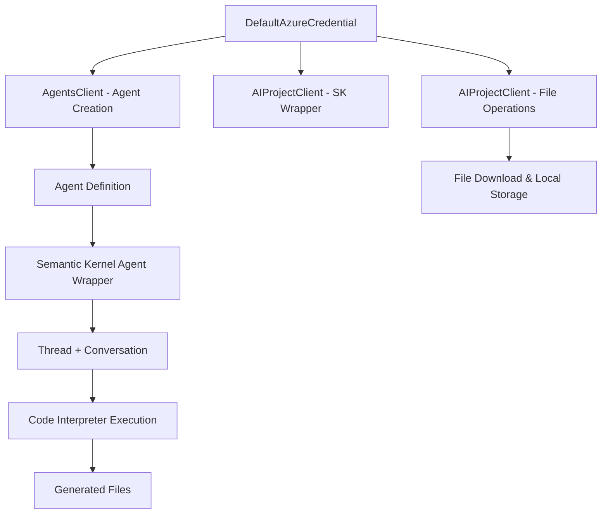

# Azure AI Foundry + Semantic Kernel Integration

A clean, educational tutorial demonstrating how to integrate Azure AI Foundry Agent Service with Semantic Kernel for code interpretation, file generation, and local file management.

## 🎯 Purpose

This project showcases a **streamlined integration pattern** for building AI agent applications that combine:
- **Azure AI Foundry Agent Service**: Direct agent creation with code interpreter
- **Semantic Kernel**: Conversation management wrapper
- **Code Interpreter**: Python code execution with file generation capabilities
- **File Management**: Secure download and local preservation of agent-generated files

## 🏗️ Architecture Overview



### Key Architecture Patterns

1. **Unified Credential Approach**:
   - Single `DefaultAzureCredential` for all Azure operations
   - Simplified authentication without sync/async complications
   - Cleaner resource management

2. **Microsoft's Recommended File Access**:
   - Uses `AIProjectClient.agents.files.get_content()` pattern
   - Proper Iterator[bytes] handling for streaming downloads
   - Memory-efficient chunk processing

3. **Comprehensive Resource Management**:
   - Ordered cleanup: threads → agents → clients
   - Local file preservation while cleaning Azure resources
   - Graceful error handling with None checks

## 📁 Project Structure

```
azure-ai-foundry-semantic-kernel-tutorial/
├── azure_ai_foundry_semantic_kernel.ipynb    # Main educational notebook
├── requirements.txt                          # Pinned dependencies  
├── .env.template                            # Environment template (committed)
├── .env                                     # Local configuration (gitignored)
├── .gitignore                              # Python/Jupyter optimized
├── .github/copilot-instructions.md        # AI assistant guidance
├── azure_ai_files/downloads/              # Generated file outputs (gitignored)
└── README.md                              # This file
```

## 🚀 Quick Start

### Prerequisites

- **Azure AI Foundry Project** with agent service enabled
- **Python 3.8+** with virtual environment support
- **Azure CLI** logged in (`az login`)
- **Environment Variables**: `PROJECT_ENDPOINT`, `MODEL_DEPLOYMENT_NAME`

### Installation

1. **Clone and Setup**:
   ```bash
   git clone https://github.com/ChrisMcKee1/azure-ai-foundry-semantic-kernel-tutorial.git
   cd azure-ai-foundry-semantic-kernel-tutorial
   python -m venv .venv
   .\.venv\Scripts\Activate.ps1  # Windows PowerShell
   ```

2. **Install Dependencies**:
   ```bash
   pip install -r requirements.txt
   ```

3. **Configure Environment**:
   ```bash
   copy .env.template .env
   # Edit .env with your Azure AI Foundry project details:
   # PROJECT_ENDPOINT=https://your-project.region.api.azureml.ms
   # MODEL_DEPLOYMENT_NAME=gpt-4o
   ```

4. **Run the Notebook**:
   ```bash
   jupyter lab azure_ai_foundry_semantic_kernel.ipynb
   ```

## 📚 Key Features Demonstrated

### 1. Unified Credential & Agent Creation

```python
# Single credential for all operations
credential = DefaultAzureCredential()
foundry_client = AgentsClient(endpoint=os.environ["PROJECT_ENDPOINT"], credential=credential)

# Create agent with code interpreter
code_interpreter = CodeInterpreterTool()
agent_definition = foundry_client.create_agent(
    model=os.environ["MODEL_DEPLOYMENT_NAME"],
    name="ChartAgent",
    instructions="Create data visualizations and save as files.",
    tools=code_interpreter.definitions,
    tool_resources=code_interpreter.resources
)
```

### 2. Semantic Kernel Wrapper

```python
# Create SK client using same credential
sk_client = AIProjectClient(endpoint=os.environ["PROJECT_ENDPOINT"], credential=credential)

# Wrap agent with Semantic Kernel
agent = AzureAIAgent(client=sk_client, definition=agent_definition)
thread = AzureAIAgentThread(client=sk_client)

# Chat with agent
async for response in agent.invoke(messages=message, thread=thread):
    print(response.content)
```

### 3. File Retrieval & Download

```python
# Microsoft's recommended file access pattern
project_client = AIProjectClient(endpoint=os.environ["PROJECT_ENDPOINT"], credential=credential)

with project_client:
    file_content_iterator = project_client.agents.files.get_content(file_id)
    file_data = b''.join(chunk for chunk in file_content_iterator)
    
    # Save locally
    with open(file_path, 'wb') as f:
        f.write(file_data)
```

## 🔧 Dependencies & Versions

### Core Libraries
- `semantic-kernel>=1.37.0` - Latest stable SK with Azure AI agent support
- `azure-ai-agents>=1.2.0b4` - Beta version for latest Azure AI Foundry features
- `azure-ai-projects>=1.0.0` - Unified project client (Microsoft recommended)
- `azure-identity>=1.25.0` - Latest auth library with async support

### Development Tools
- `vulture` - Dead code detection (dev dependency only)
- `python-dotenv` - Environment configuration management
- `nest-asyncio` - Jupyter async compatibility

## 🛡️ Security & Best Practices

### Environment Configuration

- **Never commit `.env`** - use `.env.template` for version control
- **Azure credential management** - uses `DefaultAzureCredential` pattern
- **Resource cleanup** - comprehensive Azure resource deallocation

### Error Handling

- **Graceful None checks** - prevents cleanup errors on multiple runs
- **File operation safety** - proper Iterator[bytes] handling
- **Fallback patterns** - multiple file ID detection methods

## 📖 Educational Value

This project serves as a **reference implementation** for:

1. **Enterprise AI Agent Architecture** - Production-ready patterns
2. **Microsoft SDK Integration** - Official best practices
3. **Async/Sync Separation** - Critical for avoiding coroutine issues
4. **File Management Workflows** - Secure agent-generated content handling
5. **Resource Lifecycle Management** - Proper cleanup and cost management

## 🤝 Contributing

We welcome contributions! This project follows Microsoft's coding standards and Azure best practices.

### Development Workflow
1. Create virtual environment: `python -m venv .venv`
2. Install dev dependencies: `pip install -r requirements.txt`
3. Run vulture for dead code detection: `vulture . --exclude .venv`
4. Test notebook execution order: Run cells sequentially
5. Verify resource cleanup: Check Azure portal for orphaned resources

## 📄 License

This project is licensed under the MIT License - see the [LICENSE](LICENSE) file for details.

## 🔗 Related Resources

- [Azure AI Foundry Documentation](https://learn.microsoft.com/en-us/azure/ai-foundry/)
- [Semantic Kernel Documentation](https://learn.microsoft.com/en-us/semantic-kernel/)
- [Azure AI Agents SDK](https://learn.microsoft.com/en-us/python/api/overview/azure/ai-agents-readme)
- [Microsoft Agent Framework](https://github.com/microsoft/semantic-kernel)

---
**Built with ❤️ by the community, following Microsoft's best practices for AI agent development.**
