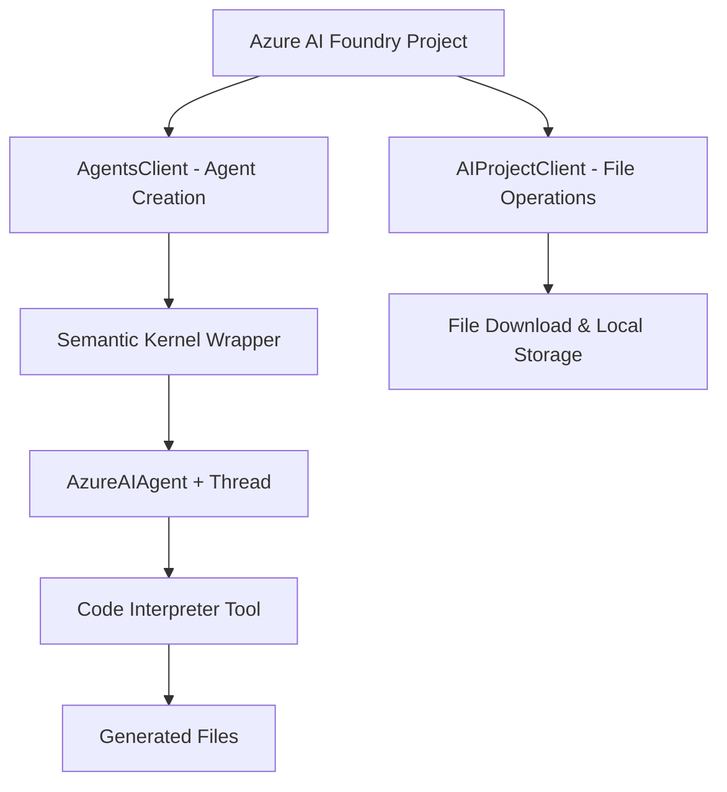

# Azure AI Foundry + Semantic Kernel Integration

A comprehensive educational project demonstrating how to integrate Azure AI Foundry Agent Service with Semantic Kernel for advanced AI agent workflows, including code interpretation, file generation, and local file management.

## 🎯 Purpose

This project showcases the **dual-SDK architecture** pattern for building robust AI agent applications that combine:
- **Azure AI Foundry Agent Service**: Direct agent creation and management
- **Semantic Kernel**: Advanced conversation management and agent orchestration
- **Code Interpreter**: Python code execution with file generation capabilities
- **File Management**: Secure download and local preservation of agent-generated files

## 🏗️ Architecture Overview



### Key Architecture Patterns

1. **Dual-SDK Integration**:
   - `DefaultAzureCredential` (sync) for Azure AI Foundry operations
   - `AsyncDefaultAzureCredential` (async) for Semantic Kernel operations
   - Critical separation prevents coroutine conflicts

2. **Microsoft's Recommended File Access**:
   - Uses `AIProjectClient.agents.files.get_content()` pattern
   - Proper Iterator[bytes] handling for streaming downloads
   - Memory-efficient chunk processing

3. **Comprehensive Resource Management**:
   - Ordered cleanup: threads → agents → clients → credentials
   - Local file preservation while cleaning Azure resources
   - Graceful error handling with None checks

## 📁 Project Structure

```
SKNotebooks/
├── azure_ai_foundry_semantic_kernel.ipynb      # Main educational notebook
├── azure_ai_foundry_semantic_kernel_comprehensive.ipynb  # Extended examples
├── requirements.txt                            # Pinned dependencies
├── template.env                               # Environment template (committed)
├── .env                                       # Local configuration (gitignored)
├── .gitignore                                 # Python/Jupyter optimized
├── azure_ai_files/downloads/                  # Generated file outputs (gitignored)
└── README.md                                  # This file
```

## 🚀 Quick Start

### Prerequisites

- **Azure AI Foundry Project** with agent service enabled
- **Python 3.8+** with virtual environment support
- **Azure CLI** logged in (`az login`)
- **Environment Variables**: `PROJECT_ENDPOINT`, `MODEL_DEPLOYMENT_NAME`

### Installation

1. **Clone and Setup**:
   ```bash
   git clone <repository-url>
   cd SKNotebooks
   python -m venv .venv
   .\.venv\Scripts\Activate.ps1  # Windows PowerShell
   ```

2. **Install Dependencies**:
   ```bash
   pip install -r requirements.txt
   ```

3. **Configure Environment**:
   ```bash
   copy template.env .env
   # Edit .env with your Azure AI Foundry project details
   ```

4. **Run the Notebook**:
   ```bash
   jupyter lab azure_ai_foundry_semantic_kernel.ipynb
   ```

## 📚 Key Features Demonstrated

### 1. Agent Creation & Management
```python
# Azure AI Foundry Agent with Code Interpreter
code_interpreter = CodeInterpreterTool()
agent_definition = foundry_client.create_agent(
    model=os.environ["MODEL_DEPLOYMENT_NAME"],
    name="ChartAgent",
    instructions="Create data visualizations and save as files.",
    tools=code_interpreter.definitions,
    tool_resources=code_interpreter.resources
)
```

### 2. Semantic Kernel Integration
```python
# Semantic Kernel wrapper for conversation management
agent = AzureAIAgent(client=sk_client, definition=agent_definition)
thread = AzureAIAgentThread(client=sk_client)

async for response in agent.invoke(messages=message, thread=thread):
    print(response.content)
```

### 3. File ID Extraction
```python
# Extract file IDs from Semantic Kernel responses
file_ids = []
for item in response.items:
    if hasattr(item, 'file_id') and item.file_id:
        file_ids.append(item.file_id)
```

### 4. Microsoft-Recommended File Download
```python
# Correct Azure AI Foundry file retrieval pattern
project_client = AIProjectClient(endpoint=endpoint, credential=credential)
with project_client:
    file_content_iterator = project_client.agents.files.get_content(file_id)
    file_data = b''.join(chunk for chunk in file_content_iterator)
```

## 🔧 Dependencies & Versions

### Core Libraries
- `semantic-kernel>=1.37.0` - Latest stable SK with Azure AI agent support
- `azure-ai-agents>=1.2.0b4` - Beta version for latest Azure AI Foundry features
- `azure-ai-projects>=1.0.0` - Unified project client (Microsoft recommended)
- `azure-identity>=1.25.0` - Latest auth library with async support

### Development Tools
- `vulture` - Dead code detection (dev dependency only)
- `python-dotenv` - Environment configuration management
- `nest-asyncio` - Jupyter async compatibility

## 🛡️ Security & Best Practices

### Environment Configuration
- **Never commit `.env`** - use `template.env` for version control
- **Azure credential management** - uses `DefaultAzureCredential` pattern
- **Resource cleanup** - comprehensive Azure resource deallocation

### Error Handling
- **Graceful None checks** - prevents cleanup errors on multiple runs
- **File operation safety** - proper Iterator[bytes] handling
- **Fallback patterns** - multiple file ID detection methods

## 📖 Educational Value

This project serves as a **reference implementation** for:

1. **Enterprise AI Agent Architecture** - Production-ready patterns
2. **Microsoft SDK Integration** - Official best practices
3. **Async/Sync Separation** - Critical for avoiding coroutine issues
4. **File Management Workflows** - Secure agent-generated content handling
5. **Resource Lifecycle Management** - Proper cleanup and cost management

## 🤝 Contributing

We welcome contributions! This project follows Microsoft's coding standards and Azure best practices.

### Development Workflow
1. Create virtual environment: `python -m venv .venv`
2. Install dev dependencies: `pip install -r requirements.txt`
3. Run vulture for dead code detection: `vulture . --exclude .venv`
4. Test notebook execution order: Run cells sequentially
5. Verify resource cleanup: Check Azure portal for orphaned resources

## 📄 License

This project is licensed under the MIT License - see the [LICENSE](LICENSE) file for details.

## 🔗 Related Resources

- [Azure AI Foundry Documentation](https://learn.microsoft.com/en-us/azure/ai-foundry/)
- [Semantic Kernel Documentation](https://learn.microsoft.com/en-us/semantic-kernel/)
- [Azure AI Agents SDK](https://learn.microsoft.com/en-us/python/api/overview/azure/ai-agents-readme)
- [Microsoft Agent Framework](https://github.com/microsoft/semantic-kernel)

## 📞 Support

For issues related to:
- **Azure AI Foundry**: [Azure Support](https://azure.microsoft.com/support/)
- **Semantic Kernel**: [GitHub Issues](https://github.com/microsoft/semantic-kernel/issues)
- **This Project**: Create an issue in this repository

---
**Built with ❤️ by the community, following Microsoft's best practices for AI agent development.**